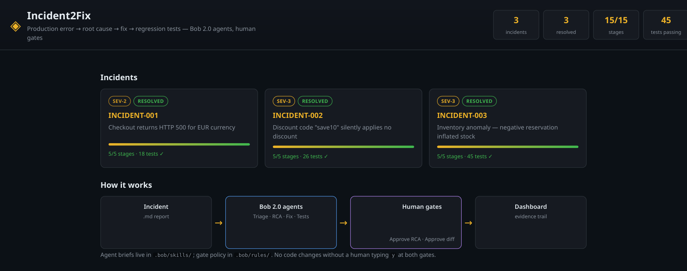
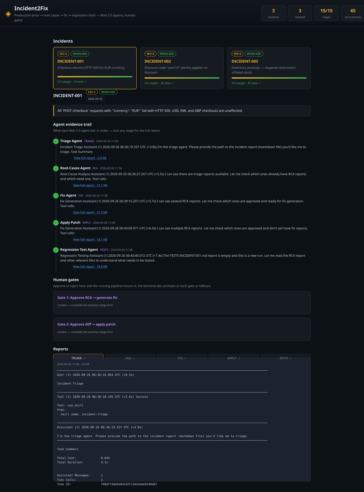
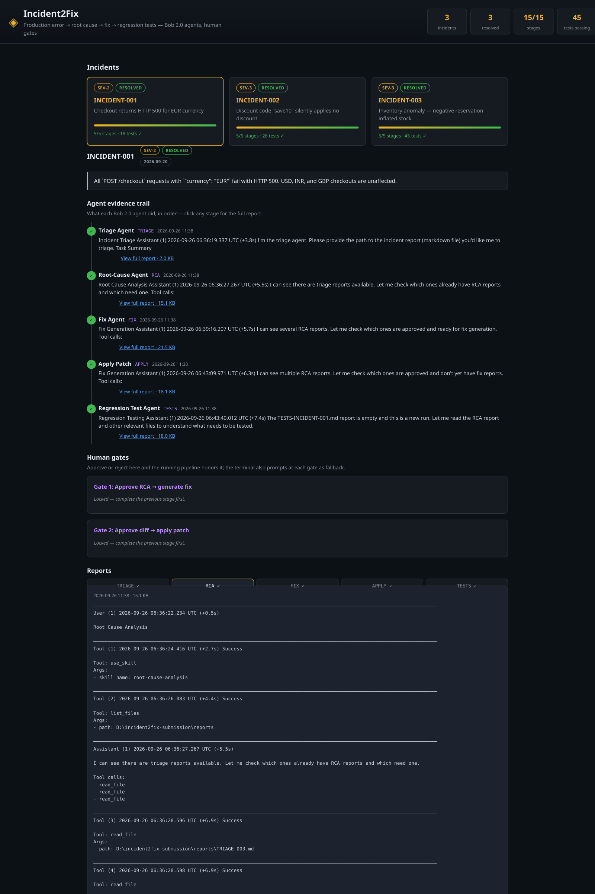
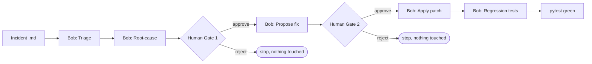

# Incident2Fix

[](https://github.com/arya123-sudo/incident2fix/actions)

Production error -> root cause -> fix -> regression tests, driven by IBM Bob 2.0 agents with human approval gates.

> Not just AI for incidents — an auditable agent that turns incidents into tested code fixes, with humans in control.

Built live during the IBM Bob 2.0 hackathon (lablab.ai, Sept 25-27 2026).

<!-- TODO(video): replace with the demo video link before submitting -->
🎬 **Demo video:** coming soon — 2-minute walkthrough of a live incident run.

📊 **Dashboard preview:**






## What is IBM Bob 2.0?

IBM Bob 2.0 is IBM's agentic coding assistant, driven from the terminal.
It executes **skills** — packaged agent briefs — against your repository, and
`bob -p "<task>"` runs a task non-interactively. Incident2Fix uses that as its
engine: the pipeline feeds each stage's inputs (incident report, code, prior
reports) to Bob 2.0, Bob reasons and acts, and a human approves the two
consequential steps. No diagnosis is hardcoded — every finding below came from Bob.

## How it works



## Real example: INCIDENT-001 (verified run, 2026-09-26)

**Input** — production incident report (`demo-app/incidents/INCIDENT-001.md`):

```
POST /checkout with {"currency": "EUR"} -> HTTP 500 (34 occurrences)
File "app/currency.py", line 12, in convert
    return amount * SUPPORTED_CURRENCIES[code]
KeyError: 'EUR'
```

**The bug** — an unguarded dict lookup (`demo-app/app/currency.py`):

```python
SUPPORTED_CURRENCIES = {"USD": 1.0, "INR": 83.2, "GBP": 0.79}

def convert(amount: float, code: str) -> float:
    return amount * SUPPORTED_CURRENCIES[code]   # KeyError: 'EUR' -> HTTP 500
```

**Bob's pipeline run** — triage confirmed SEV-2 checkout outage, RCA isolated the
unguarded lookup (Gate 1 approved), Bob proposed a minimal patch (Gate 2
approved), applied it, then generated and ran regression tests.

**Outcome:** `18 passed` — EUR checkout no longer 500s, existing USD/INR/GBP
behavior unchanged.

Full evidence from the run is in this repo: [`reports/TRIAGE-INCIDENT-001.md`](reports/TRIAGE-INCIDENT-001.md),
[`reports/RCA-INCIDENT-001.md`](reports/RCA-INCIDENT-001.md),
[`reports/FIX-INCIDENT-001.md`](reports/FIX-INCIDENT-001.md),
[`reports/APPLY-INCIDENT-001.md`](reports/APPLY-INCIDENT-001.md),
[`reports/TESTS-INCIDENT-001.md`](reports/TESTS-INCIDENT-001.md).
Same set exists for INCIDENT-002 and INCIDENT-003 — final suite: **45 passed**.

## Quickstart

### Windows (PowerShell)

```powershell
py -m venv .venv
.venv\Scripts\Activate.ps1
py -m pip install flask pytest
$env:BOB_API_KEY="paste-your-key-here"
py -m pytest demo-app/tests -q          # 5 baseline smoke tests pass
py pipeline/run.py demo-app/incidents/INCIDENT-001.md
```

### macOS / Linux

```bash
python3 -m venv .venv && source .venv/bin/activate
pip install flask pytest
export BOB_API_KEY="paste-your-key-here"
pytest demo-app/tests -q                # 5 baseline smoke tests pass
python pipeline/run.py demo-app/incidents/INCIDENT-001.md
```

Type `y` at each gate only after reviewing the RCA / proposed diff.
Anything else stops the pipeline without touching code.

### Test counts, explained

The numbers grow as Bob works — this is expected:

| When | Tests |
|---|---|
| Fresh clone (baseline smoke tests) | 5 passed |
| After INCIDENT-001 (Bob adds regression tests) | 18 passed |
| After all 3 incidents | 45 passed |

Bob's generated tests live in `demo-app/regression_tests/` (copied from real
runs — see its README). CI runs the baseline suite on every push. Full
testing strategy, including the test → incident traceability table and known
gaps, is in [docs/TESTING.md](docs/TESTING.md).

### Observed timings (real runs, 2026-09-26)

| Stage | Time |
|---|---|
| Bob agent stages (triage, RCA, fix, apply, tests) | ~25-30s total |
| Human review at the 2 gates | ~1-4 min |
| Full incident, end to end | ~5 min |
| Manual equivalent | ~15-30 min |

## Layout

- `.bob/skills/` — the four agent briefs Bob 2.0 executes, one per stage
- `.bob/rules/` — pipeline governance (the two human gates) + Python standards
- `demo-app/` — intentionally buggy Flask app + 3 incident reports
- `pipeline/` — orchestrator: feeds each stage's inputs to Bob 2.0, enforces the gates
- `reports/` — real Bob 2.0 outputs from verified runs (evidence trail)
- `dashboard/` — Flask UI: incident cards, stage tracker, report viewer
- `docs/` — architecture (with diagram), demo script, submission notes
- `bob-sessions/` — log of the real Bob 2.0 sessions behind this build

## Dashboard

```bash
# Windows: py dashboard/app.py   |   macOS/Linux: python dashboard/app.py
# open http://127.0.0.1:5001
```

Incident cards with severity badges and progress bars, a per-agent evidence
timeline, gate cards showing RCA/diff context with approve/reject + comments,
a green/red diff viewer for proposed fixes, and full report tabs.

## Bob API key (required)

The pipeline calls Bob non-interactively (`bob -p`), which needs API-key auth.
Get the key from your IBM Bob account portal (log in with the same IBM ID).

```powershell
# Windows
$env:BOB_API_KEY="paste-your-key-here"
```

```bash
# macOS/Linux — or copy .env.example to .env
export BOB_API_KEY="paste-your-key-here"
```

**Secret hygiene:** `.env`, `.env.*`, `*.pem`, `*.key` are all git-ignored
(see `.gitignore`); `.env.example` shows the expected shape. Never paste the
key into chat or commit it.

## Troubleshooting

- `ModuleNotFoundError: No module named 'pipeline'` — fixed in current code
  (`run.py` bootstraps `sys.path`); always run from the repo root.
- `Bob 2.0 CLI not found` on Windows — Bob installs as an npm `.cmd` shim;
  `bob_client.py` launches it via `cmd.exe`. Or set `BOB_CLI` to its full path.
- Garbled/crashing output on Windows — Bob emits UTF-8 box-drawing characters;
  the pipeline forces UTF-8 for subprocess I/O, report files, and console.
- `bob -p` asks for login instead of using the key — the key isn't set in that
  terminal; re-run the `$env:BOB_API_KEY=...` / `export` line (each new
  terminal needs it).
- Gate typed `y` but nothing happens — the prompt is `[y/N]`; only a literal
  `y` approves, anything else aborts the run safely.

## Team

Two-person build: backend/Bob pipeline + frontend dashboard & submission.

## License

MIT — see [LICENSE](LICENSE).
