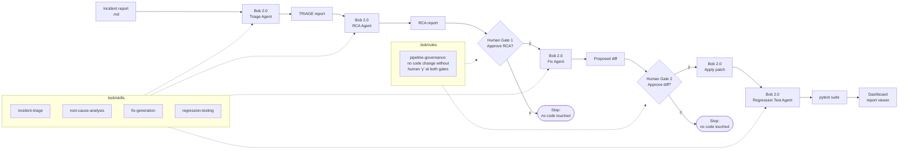

# Architecture

## Pipeline flow

```
incident.md -> [Bob: triage] -> TRIAGE report -> [Bob: RCA] -> RCA report
  -> (human gate 1) -> [Bob: fix] -> diff -> (human gate 2) -> apply
  -> [Bob: tests] -> pytest suite -> DONE
```

## System diagram



## Components

- `.bob/skills/` — the four agent briefs Bob 2.0 executes, one per stage.
  The orchestrator prepends the brief to every `bob -p` call.
- `.bob/rules/` — governance (the two human gates) + Python standards, loaded on every run.
- `demo-app/` — seeded buggy Flask app, 3 incident reports, smoke tests.
- `pipeline/` — orchestrator: feeds each stage's inputs to Bob 2.0, enforces the
  gates, writes reports to `reports/`.
- `dashboard/` — Flask UI over `reports/`: incident cards, stage tracker, report viewer.
- `bob-sessions/` — log of the real Bob 2.0 sessions behind this build.

Bob 2.0 is the engine of every stage. The orchestrator never hardcodes a diagnosis.

## Observed timings (real runs, 2026-09-26)

Measured from the first verified end-to-end runs (INCIDENT-001/002/003):

| Stage | Observed |
|---|---|
| Triage (Bob API) | ~3s |
| RCA (Bob API) | ~3s |
| Fix generation (Bob API) | ~3s |
| Patch apply (Bob API) | ~2s |
| Regression tests (Bob API + pytest) | ~3s |
| **Bob agent work, total** | **~25-30s per incident** |
| Human review at Gate 1 + Gate 2 | ~1-4 min |
| Full incident end-to-end | ~5 min |

No code is modified unless a human approves both gates — enforced in
`pipeline/run.py`: approve by typing `y` at the terminal prompt, or by
clicking Approve in the dashboard (the pipeline honors the dashboard's
recorded decision). Policy in `.bob/rules/pipeline-governance.md`.

Demo: `python pipeline/run.py demo-app/incidents/INCIDENT-001.md`
